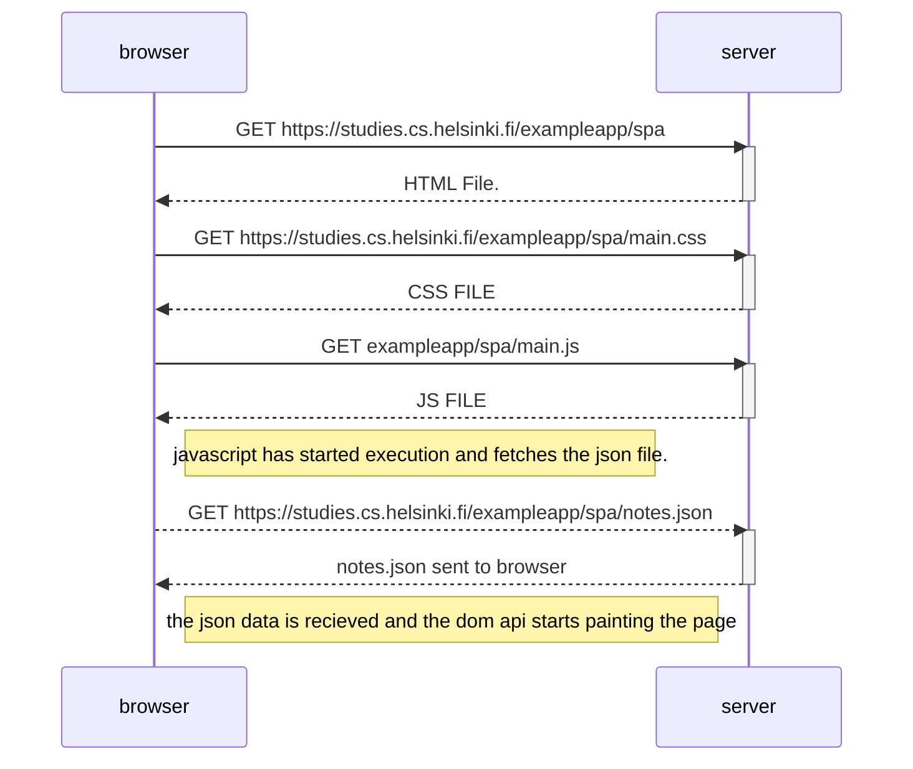

```mermaid

sequenceDiagram

participant browser
participant server

browser->>server: GET https://studies.cs.helsinki.fi/exampleapp/spa

activate server

server-->>browser: HTML File.

deactivate server

browser->>server: GET https://studies.cs.helsinki.fi/exampleapp/spa/main.css

activate server

server-->>browser: CSS FILE

deactivate server

browser->>server: GET exampleapp/spa/main.js

activate server

server-->>browser: JS FILE


deactivate server


note right of browser: javascript has started execution and fetches the json file.


browser-->>server: GET https://studies.cs.helsinki.fi/exampleapp/spa/notes.json


activate server
server-->>browser: notes.json sent to browser

deactivate server

note right of browser: the json data is recieved and the dom api starts painting the page


```