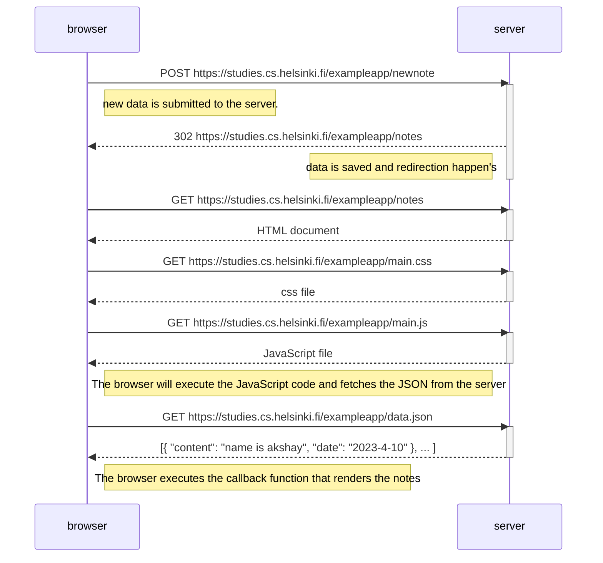

```mermaid
sequenceDiagram
    participant browser
    participant server

    browser->>server: POST https://studies.cs.helsinki.fi/exampleapp/newnote
    activate server
    note right of browser: new data is submitted to the server.
    server-->>browser: 302 https://studies.cs.helsinki.fi/exampleapp/notes

    note left of server: data is saved and redirection happen's

    deactivate server

    browser->>server: GET https://studies.cs.helsinki.fi/exampleapp/notes
    activate server
    server-->>browser: HTML document
    deactivate server

    browser->>server: GET https://studies.cs.helsinki.fi/exampleapp/main.css
    activate server
    server-->>browser: css file
    deactivate server

    browser->>server: GET https://studies.cs.helsinki.fi/exampleapp/main.js
    activate server
    server-->>browser: JavaScript file
    deactivate server

    Note right of browser: The browser will execute the JavaScript code and fetches the JSON from the server

    browser->>server: GET https://studies.cs.helsinki.fi/exampleapp/data.json
    activate server
    server-->>browser: [{ "content": "name is akshay", "date": "2023-4-10" }, ... ]
    deactivate server

    Note right of browser: The browser executes the callback function that renders the notes

```


```